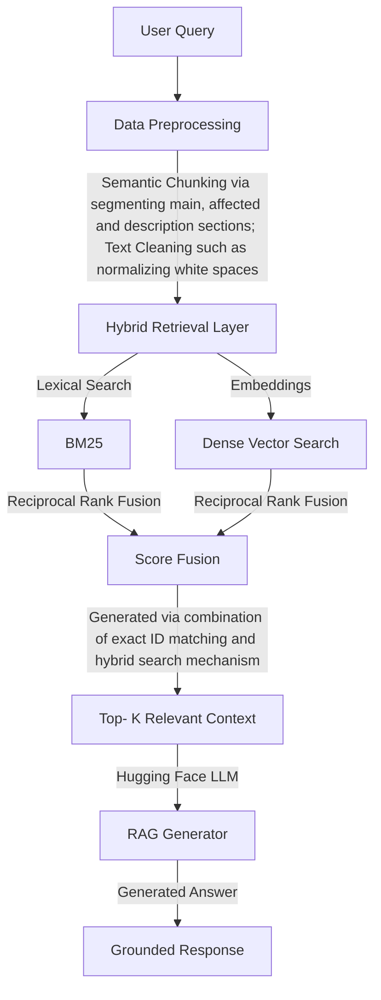

# Cybersecurity-Incident-Response-Assistant-Chatbot
This is an implementation of the project on Enterprise Cybersecurity Incident Response Assistant Chatbot.

## Objective: 
A Hybrid Search RAG-based Cyber Threat Investigation Assistant that retrieves relevant security documents and generates grounded responses.

## Architecture:

## Evaluation:
1. Retrieval Evaulation: Precision@k, Recall@k and Hit@top_k.
2. Faithfulness Metric: Context Overlap Score (Via Embedding matching between context and Generated Answer)

## Scope of Improvements:
1. A more sophisiticated embedding model can be used that will help to capture the semantics of the text much more efficiently.
2. Caching can be used to cache repeated queries.
3. To save memory, techniques like quantization and gradient accumulation can be used.

